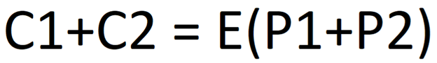

# Homomorphic Encryption: The Power of Secure Data Processing
by John Narte
  

\
[1] What is Homomorphic Encryption?
  
## Introduction
In today's digital age, data serves as the lifeblood of businesses and organizations worldwide. However, the increase in generating and sharing of data also pose significant risks to data privacy and security. Organizations are always seeking ways to secure the privacy and confidentiality of their data. Various Encryption Methods provide the means to secure data, allowing it to be transformed into a format that is not readable by human eyes, this format can only be translated by deciphering it with the appropriate decryption key. This way the data is protected from prying eyes, but a crucial issue comes up when data needs to be decrypted for use, and it is the data’s confidentiality. Not a lot of Encryption methods can provide both data privacy and confidentiality, however a method for full confidentiality was first envisioned in 1978 by Rivest, Adleman, and Dertouzos. It wasn’t until 2009 that the very first Homomorphic Encryption was constructed by a computer scientist named Craig Gentry.[1]
  
Homomorphic Encryption is an encryption method that offers a revolutionary approach to securing sensitive information while allowing computations on encrypted data. This technology will provide the much-needed confidentiality relating to the decryption of encrypted data. The main reason for the exploration of Homomorphic Encryption is to determine its future in the data encryption scene as well as to understand how it works, and to know the rough cost of implementing such a technology in a working environment.
  
## What is Homomorphic Encryption and How does it work?
Conventional encryption methods rely on cryptographic algorithms to convert plain text data into an encrypted form. During this process a cryptographic key or a secret key is generated that will facilitate the conversion of encrypted data back into its readable plain text form. Homomorphic Encryption differs from this approach because it allows computations to be performed on the encrypted data without having to use a secret key for decryption. Even after the computations, the result remains encrypted, which eliminates the risk of exposing the sensitive information during the processing of data. This method addresses the core purpose of data encryption which is safeguarding data confidentiality. To achieve this, there needs to be a relationship between plaintexts and ciphertexts, with mathematical operations on ciphertexts hiding any information about the corresponding plaintexts to maintain the integrity of the encryption.[2]
  
## Types of Homomorphic Encryption
The goal of Homomorphic Encryption is to enable an infinite number of additions or multiplications on encrypted data. The problem is designing an encryption algorithm that can do all of that is hard as a result there are a few different types of homomorphic encryption and depending on how it is designed, gets closer to the final goal of the encryption. Homomorphic Encryption comes in several types, each of which are designed to accommodate different levels of computation on encrypted data.[4]
### Partially Homomorphic Encryption (PHE)
This type allows a defined operation, either addition or multiplication, to be performed an infinite number of times. For example, a particular algorithm may be additively homomorphic, meaning adding two ciphertexts together produces the same result as encrypting the sum of the two plaintexts.
  

\
This shows a basic equation of the example above. C1+C2 represents the addition of two ciphertexts, and E(P1+P2) represents the encryption of the sum of the two plaintexts.
  
PHE algorithms are relatively easy to design, in fact common encryption algorithms like the RSA algorithm are partially homomorphic by chance. The RSA algorithm is multiplicatively homomorphic, the reason for this is because the algorithm is based on exponentiation: C = (m^x)(mod n) where m is the message and x is the secret key. The rules of exponentiation say that (a^n)(b^n)=(ab)^n, this means that multiplying two cipher texts encrypted with the same key is equivalent to raising the product of the plaintext to the power of the secret key. Through this RSA algorithm exhibits partial homomorphic properties through multiplication operations.[4]
  
### Somewhat Homomorphic Encryption (SHE)
This type allows a finite number of operations of either, addition or multiplication. For example, this algorithm may be able to support any combination of up to ten additions or multiplications producing the same result. But, If an eleventh operation of any type was to be done it would create an invalid result. SHE represents a step closer to achieving a fully homomorphic encryption although it is more challenging to design algorithms that support both addition and multiplication within predefined limits.[3]
  
### Fully Homomorphic Encryption (FHE)
This type is the ultimate goal in homomorphic encryption, this allows for an infinite number of additions or multiplications of ciphertexts while still generating a valid result. As mentioned in the introduction, in 2009 a plausible version of an FHE scheme was proposed by Craig Gentry. His scheme uses an SHE as the foundation and supports both addition and multiplication operation on ciphertexts. Since then, other algorithms have been developed that improve upon Craig Gentry’s original concept.[3]
  
## Challenges of Homomorphic Encryption
While Homomorphic Encryption holds great promise for enhancing data security it faces significant challenges to efficiency. Implementation of a PHE is easy because a lot of common encryption algorithms are PHEs by accident. But unlike PHE, implementing an FHE requires satisfying the rigorous requirements of full homomorphism i.e. allowing an infinite number of operations on ciphertexts without compromising the result. This can result in slower processing and higher storage demands.
  
For example, IBM released an improved version of their homomorphic encryption library in 2018 which was significantly faster than its predecessor, but it was still millions of times slower than plaintext operations. A calculation that would take a second to perform on plain texts would take an average of 11.5 days to perform using the 2018 version. This version is apparently 25-75 times faster than the previous version, which was 2 million times faster than the original which released around 2015. However, a speedup of about 100 million times over 3 years highlights the potential of this technology despite its limitations.[4]
  
## Conclusion
Homomorphic Encryption has the potential to redefine how we protect, and process data. While challenges persist, the rapid advancements and the dedication of the researchers and organizations who are using this technology in their systems underscore the promise of Homomorphic Encryption. In a world where data is both the catalyst for innovation and a treasure trove of sensitive information, Homomorphic Encryption represents the future of data security where we can unlock the full potential of our data without compromising its integrity.
  
Continued in [blog2](https://i0uthis.github.io/blog.intp-362/blog2)
  
## References
[1] “What is Homomorphic Encryption?,” Hashed out by The SSL StoreTM, Jun. 20, 2019. \
<https://www.thesslstore.com/blog/what-is-homomorphic-encryption/#:~:text=The%20origins%20of%20homomorphic%20encryption,the%20concept%20of%20privacy%20homomorphisms> (accessed Oct. 10, 2023).
  
[2] A. Gillis, ”What is Homomorphic Encryption?,” Tech Target | Security, Aug. 2022. \
<https://www.techtarget.com/searchsecurity/definition/homomorphic-encryption#:~:text=Homomorphic%20encryption%20enables%20complex%20mathematical,between%20elements%20in%20both%20sets> (accessed Oct. 11, 2023).
  
[3] A. Arampatzis, “What is Homomorphic Encryption & How it is Used | Venafi”, Venafi, April 28, 2023. \
<https://venafi.com/blog/homomorphic-encryption-what-it-and-how-it-used/> (accessed Oct 11, 2023).
  
[4] R. Yackel, “What is homomorphic encryption, and why isn’t it mainstream?,” Keyfactor, Jul. 06, 2021. \
<https://www.keyfactor.com/blog/what-is-homomorphic-encryption/> (accessed Oct 12 2023)
  
