# Homomorphic Encryption: A Practical Guide
<sub>by John Narte</sub>
<br/><br/>
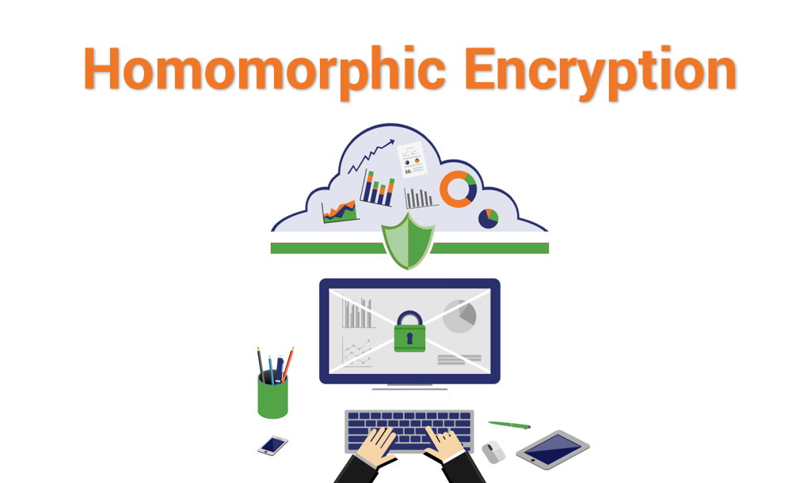
\
<br/><br/>
This blog is a continuation of “Homomorphic Encryption: The Power of Secure Data Processing” by John Narte [1]. In this blog we will expand upon the basics of homomorphic encryption, followed by a brief overview of some open source homomorphic encryption libraries currently available, and then will finish a tutorial on how to use one such libraries namely PySEAL.
<br/><br/>
## A brief into homomorphic encryption
A popular example of the use of homomorphic encryption is where a data owner wants to send data to a cloud-based service for processing, but they do not trust the service provider with their data. With a homomorphic encryption scheme, the data owner can encrypt their data and sends it to the cloud server. The server will perform the relevant computations against the data without ever needing the decryption key and sends back the encrypted results to the data owner. The data owner is then able to read the results because only they have the decryption key. This method of encryption retains the confidentiality of the encrypted data because only one person knows the key to unlocking it.[2]

The most efficient homomorphic encryption scheme when performing the same operations on multiple ciphertexts at once is the Brakerski-Gentry-Vaikuntanathan (BGV) [] scheme. The Brakerski/Fan-Vercauteren (BFV) [] and the Cheon-Kim-Kim-Song (CKKS) [] schemes share the second place for efficiency. 

These three encryption schemes are all based on lattice-based cryptography which is a branch of modern cryptography that leverages mathematical properties of lattices to create cryptographic protocols and systems. Lattices are sets of points in a multi-dimensional space that forms a grid like structure that can be visualized as grid of points with regularly spaced rows and columns. 

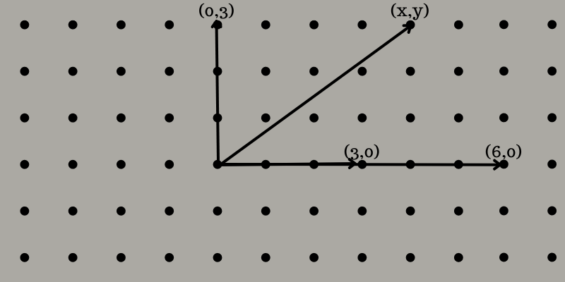

There are several hard problems within these lattices that form the basis of lattice-based cryptography. The most common ones include Shortest Vector Problem (SVP), Closes Vector Problem (CVP), Learning With Errors (LWE), and Ring Learning With Errors (RLWE). These hard problems all solve for different things, SVP solves for the shortest non-zero vector in a lattice, CVP solves for the lattice point closest to a given point, LWE determines a secret from noisy information about linear equations in a lattice, and RWLE solves for the same problem as LWE but in polynomial rings. Which is a mathematical structure where you can perform operations such as addition, subtraction, multiplication, and division on polynomials.

The three encryption schemes mentioned above are dependent on the hardness of the RWLE problem. BGV, BFV, and CKKS are additively and multiplicatively homomorphic which means you can perform both addition and multiplication (no division) within the encrypted domain. In BGV and BFV, computations can only be performed on integers. In CKKS, computations can be performed on complex numbers with limited precision. However, you cannot perform unlimited computations within the encrypted domain without running into two issues:

Issue 1: In BGV and BFV, the plaintext modulus or remainder p defines the range of values that can be encrypted and operated upon. Consider, p = 9 and you perform an operation enc(4) + enc(8) = enc(3) modulo 9. After decryption, if you’re not cautious the decrypted result could be 3 or any integer that equates to 3 modulo 9, such as 3, 12, 21, and so on. This issue arises because modulo operations can produce multiple equivalent results within the modulus. For example, in modulo 9 arithmetic, all values that leave a remainder of 3 when divided by 9 are considered equivalent. Meaning during decryption if a result of 3 is encountered, it could mean any number that, when divided by 9, gives a remainder of 3. To distinguish the right result from these equivalent possibilities in cryptographic applications, careful handling or additional mechanisms is required to ensure the correct interpretation of the decrypted value within the defined modulus space.[]

Issue 2: In both schemes during operations some level of error or noise is introduced. If this noise exceeds a certain threshold, it can corrupt the encrypted data which makes the decryption unreliable or incorrect. To prevent this, we can utilize the RLWE problem where we can deliberately introduce a small amount of error to a lattice point, this is designed to make it harder to determine the original point in the lattice the error was added. The noise in the encryption schemes can be lowered by applying some form of noise management. BGV, BFV, and CKKS all involve some form of noise management, BGV demands meticulous control at every step of the decryption process. BFV simplifies the noise management by utilizing modulus switching, and CKKS uses different techniques to handle noise while dealing with real-number calculations. The complexity of the noise management will impact the practicality and efficiency of these encryption schemes in real world applications. []

A method to reduce the amount of noise was introduced by Craig Gentry [], which enabled the very first Fully Homomorphic Encryption (FHE) scheme that can do unlimited computations to be made in the encrypted domain. However, this method is an expensive operation which is why it is best to avoid using it unless you really want to. What BFV and CKKS use to allow for multiple ciphertext multiplications to be performed is the scale-invariant error-reduction technique, which aims to do the same as the method Craig Gentry introduced in the very first FHE scheme. This technique involves scaling data and intermediate results during computations to control noise growth while maintaining precision. By adjusting the scaling factors and periodically applying rescaling operations, this technique does not completely reduce the noise amount it merely aims to keep the noise within a manageable limit. This allows BFV and CKKS to have accurate approximate arithmetic on encrypted real numbers by efficiently managing and reducing the effects of noise which enables secure computations while preserving computation accuracy in scenarios where real number operations within the encrypted domain is essential.

The information mentioned above are all the constraints within which you will have to work with to write code using Homomorphic Encryption.

<br/><br/>
## Homomorphic Encryption Libraries
There is a plethora of open-source libraries about homomorphic encryption, in fact there is a GitHub repository dedicated to just listing these libraries.[4] From the list, the ones that I have heard or seen before are PALISADE, SEAL, HElib and PySEAL. 

PALISADE [] is a DARPA and IARPA-funded project. It offers implementations of various lattice-based encryption schemes such as BGV, BFV and CKKS. This library provides a flexible framework which allows users to experiment with different parameter settings, algorithms, and cryptographic primitives within lattice-based cryptography.

SEAL [], which stands for “Simple Encrypted Arithmetic Library” is an encryption library developed by Microsoft Research []. It primarily focuses on implementing the BFV and CKKS encryption schemes, which allows computations on encrypted data enabling privacy-preserving computation in scenarios like cloud computing or secure data analysis. SEAL is designed with a focus on efficiency and performance, it employs optimizations to accelerate operations on encrypted data. Which allows for faster computations while maintaining security.

HElib [], which stands for “Homomorphic Encryption Library” is an encryption library developed by researchers at IBM Research. This library supports the implementation of the Gentry-FHE scheme based on ideal lattices. This scheme allows for random computations on encrypted data while preserving the privacy of the data. This library serves as a platform for researchers, developers, and anyone who is interested in exploring and experimenting with homomorphic encryption.

PySEAL [] is a Python wrapper around Microsoft’s SEAL library, it is designed to facilitate homomorphic encryption in Python-based environments. This makes it convenient for Python developers to work with homomorphic encryption without need to interface with the C++ implementation directly. PySEAL serves as a bridge between the powerful encryption library of SEAL and the Python Environment, allowing for a more accessible and user-friendly way to perform computations on encrypted data for Python developers.
<br/><br/>

<br/><br/>
## Demonstration on SEAL-Python []
The PySEAL repository in GitHub unfortunately is only a proof of concept however I found another repository made by a GitHub user called “Huelse” [] called SEAL-Python. The repository has a guide on how to setup SEAL-python in Linux and Windows environments.
<br/><br/>
### Installing Prerequisites:<br>
•	SEAL-python requires a couple of packages that need install. To install them use the following commands: <br>
“sudo apt-get install git build-essential cmake python3 python3-dev python3-pip”
<br>
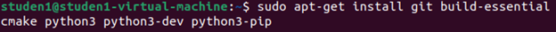
<br>
<br>
### Clone SEAL-Python: <br>
•	Clone the SEAL-Python library using the git command from GitHub
•	If you would want to have the repository cloned to a different place move to it before executing the following commands: <br>
“git clone https://github.com/Huelse/SEAL-Python.git” <br>
<br>
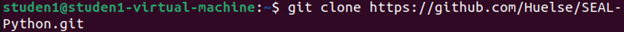
<br>
•	Once the clone is finished move into the repository using the cd command: <br>
“cd SEAL-Python”
<br>
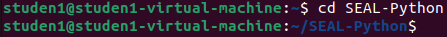
<br>
<br>
### Install dependencies: <br>
•	Use the pip command to install required dependencies for SEAL-Python <br>
“pip3 install numpy pybind11”
<br>
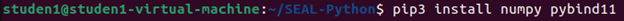
<br>
<br>
### Initialize SEAL and pybind11: <br>
•	Update and initialize the submodules needed by the SEAL-Python library using the “git submodule” command: <br>
“git submodule update –init –recursive”
<br>
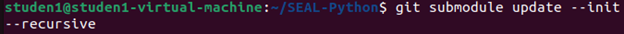 
<br>
<br>
### Build the SEAL library: <br>
•	In the SEAL-Python directory navigate to the ‘SEAL’ directory
•	In the directory use the cmake command to configure the SEAL library <br>
“cmake -S . -B build -DSEAL_USE_MSGSL=OFF -DSEAL_USE_ZLIB=OFF”
<br>

<br>
•	Build the library using the following command: <br>
“cmake --build build”
<br>
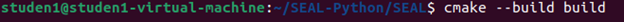
<br>
<br>
### Running the Setup: <br>
•	After the SEAL library is successfully built, return to the root directory of SEAL-Python and run the setup.py file to build and install the necessary extensions. <br>
“python3 setup.py build_ext -I”
<br>
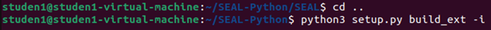
<br>
<br>
### Test the installation: <br>
•	If everything has been setup correctly, SEAL-Python should be ready to use. But before that we will need to test and see.
•	First we will need to copy the ‘seal.*.so’ file to the example directory 
<br>
 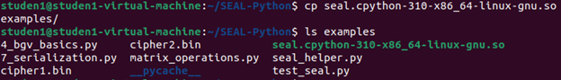
<br>
•	Run the ‘4_bgv_basics.py’ file to test the functionality of the library. 
<br>
 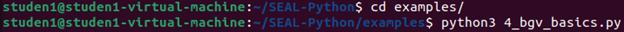
<br>
•	If all is working correctly the output should look like this:
<br>
 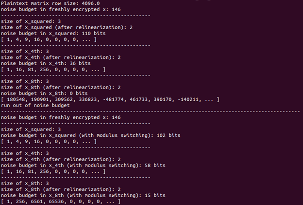

Now we have installed SEAL-Python. Next I will be demonstrating using my own python code based on the SEAL-Python library to demonstrate some basic operations using the BGV scheme. This code will include the setting up of encryption parameters, key generation, encryption and decryption, batch encoding, homomorphic operations, modulus switching and printing the results of each operation.

## SEAL-Python code: <br>
***Disclaimer: This code does not represent Homomorphic encryption in a real world setting as it does the encryption and decryption in one script*** <br>
The code below will demonstrate the basic usage of SEAL library for homomorphic encryption: <br>
```
from seal import *
import random
    
def customHE():
        #setup SEAL parameters
        parms = EncryptionParameters(scheme_type.bgv)
        polyModDeg = 8192
        parms.set_poly_modulus_degree(polyModDeg)
        parms.set_coeff_modulus(CoeffModulus.BFVDefault(polyModDeg))
        parms.set_plain_modulus(PlainModulus.Batching(polyModDeg, 20))
        context = SEALContext(parms)
    
        #generate keys
        keygen = KeyGenerator(context)
        secretKey = keygen.secret_key()
        publicKey = keygen.create_public_key()
        relinKeys = keygen.create_relin_keys()

        #initiallize encrytor and decryptor
        encryptor = Encryptor(context, publicKey)
        evaluator = Evaluator(context)
        decryptor = Decryptor(context, secretKey)

        #initiallize batch encoding for encryption
        batchEncode = BatchEncoder(context)
        slotCount = batchEncode.slot_count()
        rowSize = slotCount / 2
        print(f'Plaintext matrix row size: {rowSize}\n')

        #create plaintext string data to be encrypted
        msg = ["Hello", "this is a secret message", "you should not have the secret key", "Lorem ipsum dolor sit amet, consectetur adipiscing elit. Proin tempor, leo a condimentum cursus, odio augue malesuada est, dapibus interdum dui mi et lectus. Vivamus pharetra erat orci. Nunc congue dolor non dolor ultrices tempor. Sed a velit lacinia leo porta dictum nec malesuada justo. Morbi sollicitudin quam sit amet enim lobortis, nec pretium ligula gravida. Ut odio ante, mattis et ante quis, laoreet ornare augue. Morbi ut lacus lacus. Etiam nec est luctus, gravida elit a, fermentum nibh. Vestibulum aliquam nisi non eros lobortis tristique. Maecenas iaculis ex sed eros feugiat sollicitudin. Ut convallis dolor quis leo tempor egestas. Quisque hendrerit odio vitae erat egestas egestas. Sed in commodo risus, nec elementum neque."]
    
        concMsg = ' '.join(msg)
        
        #convert message into numbers
        matrix = convMsgtoNum(concMsg, slotCount)
    
        #print original message
        print(f"Original Messages: {msg}\n")
    
        #encode messages
        plain1 = batchEncode.encode(matrix)
    
        #encrypt messages
        encrypted1 = encryptor.encrypt(plain1)

        #decrypt the encrypted data
        decrypted_result = decryptor.decrypt(encrypted1)
        podResult = batchEncode.decode(decrypted_result)
        
        #print the decrypted message
        print(f"Decrypted Message: {convNumtoMsg(podResult)}\n")
        
        #show characteristics of the ciphertext
        noise = decryptor.invariant_noise_budget(encrypted1)
        print(f"Noise budget of ciphertext: {noise} bits\n")
        size = encrypted1.size()
        print(f"Size of ciphertext: {2} polynomials\n")
        params = encrypted1.parms_id()
        print(f"Encryption parameters of ciphertext: {params}\n")

#function to convert string message to numerical numbers using the ord() function
def convMsgtoNum(message, slotCount):
        # Convert the message to a numerical representation (plaintext)
        return [ord(char) for char in message]


def convNumtoMsg(numbers):
        # Convert numerical representation back to string message
        return ''.join(chr(number) for number in numbers)


if __name__ == "__main__":
        customHE()

```
<br>
This code demonstrates the encryption and decryption process for a concatenated message and showcases different characteristics of the resulting ciphertext such as noise budget, size, and the encryption parameters. It handles the multiple messages via batch encoding within a single encryption.
<br>
Output of code: <br>
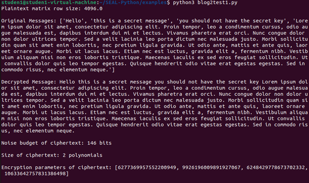


<br/><br/>
# References: <br>
[1]https://i0uthis.github.io/blog.intp-362/ <br>
[2]https://www.private-ai.com/2018/12/26/homomorphic-encryption-for-beginners-a-practical-guide-part-1/ <br>
https://eprint.iacr.org/2011/277.pdf (BGV) <br>
https://eprint.iacr.org/2012/144.pdf (BFV) <br>
https://eprint.iacr.org/2016/421.pdf (CKKS) <br>
https://github.com/Microsoft/SEAL <br>
[3]https://medium.com/privacy-preserving-natural-language-processing/homomorphic-encryption-for-beginners-a-practical-guide-part-1-b8f26d03a98a <br>
https://www.youtube.com/watch?v=7vJJMU2gMn4 <br>
[4]https://github.com/jonaschn/awesome-he <br>
https://github.com/Huelse/SEAL-Python <br>
https://medium.com/cryptoblog/what-is-lattice-based-cryptography-why-should-you-care-dbf9957ab717 <br>
https://crypto.stanford.edu/craig/craig-thesis.pdf <br>
https://medium.com/bioquest/pyseal-homomorphic-encryption-in-a-user-friendly-python-package-51dd6cb0411c <br>
https://github.com/Huelse <br>
https://geekflare.com/lattice-based-cryptography/ <br>

