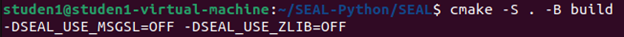

# Homomorphic Encryption: A Practical Guide
<sub>by John Narte</sub>
<br/><br/>

\
<br/><br/>
This blog is a continuation of “[Homomorphic Encryption: The Power of Secure Data Processing](https://i0uthis.github.io/blog.intp-362/)” by John Narte [1]. In this blog we will delve deeper into the fundamentals of homomorphic encryption, followed by a brief overview of some open-source homomorphic encryption libraries currently available, and concludes with a tutorial on how to use one such libraries namely SEAL.
<br/><br/>

## Fundamentals of Homomorphic Encryption
Homomorphic encryption’s essence lies in enabling computations on encrypted data without decryption. For instance, A popular example of the use of homomorphic encryption is where a data owner wants to send data to a cloud-based service for processing, but they do not trust the service provider with their data. Using a homomorphic encryption scheme, the data owner can encrypt their data and send it to the cloud server. The server will perform computations against the data without ever needing the decryption key and sends back the encrypted results to the data owner which maintains the data’s confidentiality and integrity. [2] Schemes like Brakerski-Gentry-Vaikuntanathan (BGV), Brakerski/Fan-Vercauteren (BFV) and Cheon-Kim-Kim-Song (CKKS) all leverage lattice-based cryptography, which utilizes mathematical properties of lattices for cryptographic systems. [2]
<br/><br/>

## Encryption Schemes and Challenges
Lattice-based cryptography which is a branch of modern cryptography that leverages mathematical properties of lattices to create cryptographic protocols and systems. Lattices are sets of points in a multi-dimensional space that forms a grid like structure that can be visualized as grid of points with regularly spaced rows and columns. [3]


The encryption schemes mentioned above all rely on complex lattice-based problems like Shortest Vector Problem (SVP), Closes Vector Problem (CVP), Learning With Errors (LWE), and Ring Learning With Errors (RLWE). These hard problems all solve for different things, SVP solves for the shortest non-zero vector in a lattice, CVP solves for the lattice point closest to a given point, LWE determines a secret from noisy information about linear equations in a lattice, and RWLE solves for the same problem as LWE but using polynomial rings. Which is a mathematical structure where you can perform operations such as addition, subtraction, multiplication, and division on polynomials.

BGV, BFV, and CKKS are additively and multiplicatively homomorphic which means you can perform both addition and multiplication (no division) within the encrypted domain. In BGV and BFV, computations can only be performed on integers. In CKKS, computations can be performed on complex numbers with limited precision. However, you cannot perform unlimited computations within the encrypted domain without running into two issues:

Issue 1: In BGV and BFV, the plaintext modulus or remainder p defines the range of values that can be encrypted and operated upon. Consider, p = 9 and you perform an operation enc(4) + enc(8) = enc(3) modulo 9. After decryption, if you’re not cautious the decrypted result could be 3 or any integer that equates to 3 modulo 9, such as 3, 12, 21, and so on. This issue arises because modulo operations can produce multiple equivalent results within the modulus. For example, in modulo 9 arithmetic, all values that leave a remainder of 3 when divided by 9 are considered equivalent. Meaning during decryption if a result of 3 is encountered, it could mean any number that, when divided by 9, gives a remainder of 3. To distinguish the right result from these equivalent possibilities in cryptographic applications, careful handling or additional mechanisms is required to ensure the correct interpretation of the decrypted value within the defined modulus space. [2]

Issue 2: In both schemes during operations some level of error or noise is introduced. If this noise exceeds a certain threshold, it can corrupt the encrypted data which makes the decryption unreliable or incorrect. To prevent this, we can utilize the RLWE problem where we can deliberately introduce a small amount of error to a lattice point, this is designed to make it harder to determine the original point in the lattice the error was added. The noise in the encryption schemes can be lowered by applying some form of noise management. BGV, BFV, and CKKS all involve some form of noise management, BGV demands meticulous control at every step of the decryption process. BFV simplifies the noise management by utilizing modulus switching, and CKKS uses different techniques to handle noise while dealing with real-number calculations. The complexity of the noise management will impact the practicality and efficiency of these encryption schemes in real world applications. [2]

<br/><br/>

## Managing Noise
Noise management becomes crucial, influencing the practicality and efficiency of the encryption schemes. BFV and CKKS employ the scale invariant error reduction technique which aims to control the noise growth while maintaining precision in encrypted computations. Craig Gentry introduced an initial Fully Homomorphic Encryption (FHE) [4] scheme which allows for unlimited computations, it is an expensive operation to implement. Which encourages reliance on more efficient noise management techniques like the one by BFV and CKKS. [2]

The information mentioned above are all the constraints within which you will have to work with to write code using Homomorphic Encryption.

<br/><br/>

## Homomorphic Encryption Libraries
There are several open-source libraries that support homomorphic encryption. [5] These include PALISADE, SEAL, HElib, and PySEAL. PALISADE [6] is a DARPA and IARPA-funded project. It offers implementations of various lattice-based encryption schemes such as BGV, BFV and CKKS. This library provides a flexible framework that encourages users to experiment with different parameters in its library. SEAL [7], which stands for “Simple Encrypted Arithmetic Library” is an encryption library developed by Microsoft Research. It primarily focuses on implementing the BFV and CKKS encryption schemes. SEAL is designed with a focus on efficiency and performance in computations on encrypted data. HElib [8], which stands for “Homomorphic Encryption Library” is an encryption library developed by researchers at IBM Research. This library supports the implementation of the Gentry-FHE scheme based on ideal lattices. which allows for random computations on encrypted data while preserving the privacy of the data. This library serves as a platform for researchers, developers, and anyone who is interested in exploring and experimenting with homomorphic encryption. PySEAL [9] is a Python wrapper around Microsoft’s SEAL library, it is designed to facilitate homomorphic encryption in Python-based environments. Which provides convenience and accessibility for Python developers.
<br/><br/>

<br/><br/>

## Demonstration on Microsoft SEAL using SEAL-Python [10]
The PySEAL repository in GitHub unfortunately is only a proof of concept however I found another repository made by a GitHub user called “Huelse” [11] called SEAL-Python.
<br/><br/>

### Installing Prerequisites:
<br/><br/>
•	SEAL-python requires a couple of packages that need install. To install them use the following commands: <br>
“sudo apt-get install git build-essential cmake python3 python3-dev python3-pip”
<br/><br/>

<br/><br/>

### Clone SEAL-Python:
<br/><br/>
•	Clone the SEAL-Python library using the git command from GitHub
•	If you would want to have the repository cloned to a different place move to it before executing the following commands: <br>
“git clone https://github.com/Huelse/SEAL-Python.git” <br>
<br/><br/>

<br/><br/>
•	Once the clone is finished move into the repository using the cd command: <br>
“cd SEAL-Python”
<br/><br/>

<br/><br/>

### Install dependencies: 
<br/><br/>
•	Use the pip command to install required dependencies for SEAL-Python <br>
“pip3 install numpy pybind11”
<br/><br/>

<br/><br/>

### Initialize SEAL and pybind11: 
<br/><br/>
•	Update and initialize the submodules needed by the SEAL-Python library using the “git submodule” command: <br>
“git submodule update –init –recursive”
<br/><br/>
 
<br/><br/>

### Build the SEAL library: 
<br/><br/>
•	In the SEAL-Python directory navigate to the ‘SEAL’ directory
•	In the directory use the cmake command to configure the SEAL library <br>
“cmake -S . -B build -DSEAL_USE_MSGSL=OFF -DSEAL_USE_ZLIB=OFF”
<br/><br/>

<br/><br/>
•	Build the library using the following command: <br>
“cmake --build build”
<br/><br/>

<br/><br/>

### Running the Setup: 
<br/><br/>
•	After the SEAL library is successfully built, return to the root directory of SEAL-Python and run the setup.py file to build and install the necessary extensions. <br>
“python3 setup.py build_ext -I”
<br/><br/>

<br/><br/>

### Test the installation: 
<br/><br/>
•	If everything has been setup correctly, SEAL-Python should be ready to use. But before that we will need to test and see.
•	First we will need to copy the ‘seal.*.so’ file to the example directory 
<br/><br/>
 
<br/><br/>
•	Run the ‘4_bgv_basics.py’ file to test the functionality of the library. 
<br/><br/>
 
<br/><br/>
•	If all is working correctly the output should look like this:
<br/><br/>
 

Now we have installed SEAL-Python. Next I will be demonstrating using my own python code based on the SEAL-Python library to demonstrate some basic operations using the BGV scheme. This code will include the setting up of encryption parameters, key generation, encryption and decryption, batch encoding, homomorphic operations, modulus switching and printing the results of each operation.

## SEAL-Python code: 
<br/><br/>
***Disclaimer: This code does not represent Homomorphic encryption in a real world setting as it does the encryption and decryption in one script*** <br>
The code below will demonstrate the basic usage of SEAL library for homomorphic encryption: <br>
```
from seal import *
import random
    
def customHE():
        #setup SEAL parameters
        parms = EncryptionParameters(scheme_type.bgv)
        polyModDeg = 8192
        parms.set_poly_modulus_degree(polyModDeg)
        parms.set_coeff_modulus(CoeffModulus.BFVDefault(polyModDeg))
        parms.set_plain_modulus(PlainModulus.Batching(polyModDeg, 20))
        context = SEALContext(parms)
    
        #generate keys
        keygen = KeyGenerator(context)
        secretKey = keygen.secret_key()
        publicKey = keygen.create_public_key()
        relinKeys = keygen.create_relin_keys()

        #initiallize encrytor and decryptor
        encryptor = Encryptor(context, publicKey)
        evaluator = Evaluator(context)
        decryptor = Decryptor(context, secretKey)

        #initiallize batch encoding for encryption
        batchEncode = BatchEncoder(context)
        slotCount = batchEncode.slot_count()
        rowSize = slotCount / 2
        print(f'Plaintext matrix row size: {rowSize}\n')

        #create plaintext string data to be encrypted
        msg = ["Hello", "this is a secret message", "you should not have the secret key", "Lorem ipsum dolor sit amet, consectetur adipiscing elit. Proin tempor, leo a condimentum cursus, odio augue malesuada est, dapibus interdum dui mi et lectus. Vivamus pharetra erat orci. Nunc congue dolor non dolor ultrices tempor. Sed a velit lacinia leo porta dictum nec malesuada justo. Morbi sollicitudin quam sit amet enim lobortis, nec pretium ligula gravida. Ut odio ante, mattis et ante quis, laoreet ornare augue. Morbi ut lacus lacus. Etiam nec est luctus, gravida elit a, fermentum nibh. Vestibulum aliquam nisi non eros lobortis tristique. Maecenas iaculis ex sed eros feugiat sollicitudin. Ut convallis dolor quis leo tempor egestas. Quisque hendrerit odio vitae erat egestas egestas. Sed in commodo risus, nec elementum neque."]
    
        concMsg = ' '.join(msg)
        
        #convert message into numbers
        matrix = convMsgtoNum(concMsg, slotCount)
    
        #print original message
        print(f"Original Messages: {msg}\n")
    
        #encode messages
        plain1 = batchEncode.encode(matrix)
    
        #encrypt messages
        encrypted1 = encryptor.encrypt(plain1)

        #decrypt the encrypted data
        decrypted_result = decryptor.decrypt(encrypted1)
        podResult = batchEncode.decode(decrypted_result)
        
        #print the decrypted message
        print(f"Decrypted Message: {convNumtoMsg(podResult)}\n")
        
        #show characteristics of the ciphertext
        noise = decryptor.invariant_noise_budget(encrypted1)
        print(f"Noise budget of ciphertext: {noise} bits\n")
        size = encrypted1.size()
        print(f"Size of ciphertext: {2} polynomials\n")
        params = encrypted1.parms_id()
        print(f"Encryption parameters of ciphertext: {params}\n")

#function to convert string message to numerical numbers using the ord() function
def convMsgtoNum(message, slotCount):
        # Convert the message to a numerical representation (plaintext)
        return [ord(char) for char in message]


def convNumtoMsg(numbers):
        # Convert numerical representation back to string message
        return ''.join(chr(number) for number in numbers)


if __name__ == "__main__":
        customHE()

```
<br/><br/>
This code demonstrates the encryption and decryption process for a concatenated message and showcases different characteristics of the resulting ciphertext such as noise budget, size, and the encryption parameters. It handles the multiple messages via batch encoding within a single encryption. 
<br/><br/>

### Output of Code:
<br/><br/>


<br/><br/>

### Plaintext matrix: 
<br/><br/>
The output of this shows the plaintext matrix size which refers to the number of slots required for encoding a message. If we consider my example my message contains four lines of strings that have varying number of characters. Each of those characters would require their own slot in the plaintext matrix but the exact number of slots needed may vary depending on the encoding scheme used to pack characters into the slots. In my code, I am using a batch encoding scheme which allows for multiple characters to be packed into a single slot, reducing the total number of slots needed.
<br/><br/>

### Encryption and Decryption: 
<br/><br/>
As you can see the output of my code shows the original message as it was typed in a dictionary and the decrypted message shown as a string printed with a print statement. Unfortunately, I am unable to show what the encrypted message looks like as SEAL does not allow for such a thing. 
If you try to print the encrypted message you would likely get something like this: <br>

<br/><br/>
This represents the memory reference or the object itself and not the actual content of the ciphertext. You cannot directly print the encrypted data as you would regular data, which makes sense as it can destroy the encryption’s integrity. For debugging/illustration processes Microsoft SEAL allows for the extraction of specific properties of the ciphertext object like the noise budget, ciphertext size, and encryption parameters.
<br/><br/>

### Noise Budget: 
<br/><br/>

<br/><br/>
As mentioned above the noise or error is introduced during the operation of the encryption. Noise budget is not the same as the Noise Threshold. Noise Budget refers to the amount of noise present in the ciphertext and Noise threshold refers to a predetermined limit that when reach could cause potential issues with the security or accuracy of the encrypted data. The noise budget shows the “health” of the encrypted data, ensuring that the noise doesn’t reach the noise threshold. If the noise budget decreases too much, it may impact the reliability of the decryption process. Having a way to manage the noise budget is crucial to maintaining security and accuracy of the computations in a homomorphic encryption scheme.
<br/><br/>

### Ciphertext Size: 
<br/><br/>

<br/><br/>
My code’s ciphertext size mean that my ciphertext contains two polynomials which relates to the structure of the BGV scheme my code is using. The scheme involves the handling of multiple polynomials within a single ciphertext for homomorphic operations. Each polynomial in the ciphertext may represent different parts of the encrypted, and the size of the polynomials in the ciphertext can change as operations are performed on it.
<br/><br/>

### Encryption Parameters: 
<br/><br/>

<br/><br/>
These numbers in SEAL refers to the parameters used during the encryption process. Each ID correspond to different aspects of the encryption scheme, aspects like poly modulus degree, coefficient modulus and plain modulus. Poly modulus degree determines the size of the polynomials that the HE scheme deals with, higher degree values will offer stronger security but increases the complexity of the computations. Coefficient modulus directly influences the ciphertext size and noise budget which affects security and precision of the HE computations. Plain modulus determines the size of the plaintext data type and the consumption of noise budget in multiplications, it’s specifically tailored for batching operations. A smaller plain modulus value will provide better efficiency but reduces the amount of data that can be encrypted.
<br/><br/>

## Conclusion
Homomorphic Encryption enables secure computation on encrypted data while preserving its integrity. We explored schemes like BGV, BFV, and CKKS and talked about the challenges one can face when they try their hand creating a homomorphic encryption scheme. We explored Libraries like PALISADE, SEAL, HElib and PySEAL all of which shows the diverse capabilities of homomorphic encryption. We tried our hand at using homomorphic encryption using SEAL-Python, which unfortunately does not reflect the way homomorphic encryption can be used in the real world. However, it gives us a glimpse into this encryption method’s operations and characteristics. Overall this technology has immense potential to revolutionize how we can secure our data, while ensuring confidentiality in computations for a privacy centered digital future.
<br/><br/>

# References: 
[1] C. Crane, “What is Homomorphic Encryption?,” Hashed out by The SSL StoreTM, Jun. 20, 2019.
 https://www.thesslstore.com/blog/what-is-homomorphic-encryption/ (accessed Nov 13, 2023).
<br/><br/>
[2] P. Thaine, “Part 1: Homomorphic Encryption for Beginners,” Private-AI, December 26, 2018. https://www.private-ai.com/2018/12/26/homomorphic-encryption-for-beginners-a-practical-guide-part-1/ (accessed Nov. 13, 2023)
<br/><br/>
[3] A. Pathak, “Lattice-Based Cryptography Explained in 5 Minutes or Less,” geekflare, May 3, 2023. https://geekflare.com/lattice-based-cryptography/ (accessed Nov. 13, 2023)
<br/><br/>
[4] C. Gentry, “A FULLY HOMOMORPHIC ENCRYPTION SCHEME,” 2009. https://crypto.stanford.edu/craig/craig-thesis.pdf (accessed Nov. 13, 2023)
<br/><br/>
[5] J. Schneider, “Awesome Homomorphic Encryption,” GitHub, Aug. 3, 2023. https://github.com/jonaschn/awesome-he (accessed Nov. 13, 2023)
<br/><br/>
[6] “PALISADE Homomorphic Encryption Software Library – An Open-Source Lattice Crypto Software Library.” https://palisade-crypto.org/ (accessed Nov. 15, 2023)
<br/><br/>
[7] “Microsoft SEAL,” GitHub, Nov. 27, 2022. 
https://github.com/microsoft/SEAL (accessed Nov. 15, 2023)
<br/><br/>
[8] “HElib,” GitHub, Jan. 24, 2023. 
https://github.com/homenc/HElib (accessed Nov. 15, 2023)
<br/><br/>
[9] “Lab41/PySEAL,” GitHub, Oct. 12, 2023. 
https://github.com/Lab41/PySEAL (accessed Nov. 15, 2023)
<br/><br/>
[10] huelse, “Huelse/SEAL-Python,” GitHub, Nov. 23, 2023. https://github.com/Huelse/SEAL-Python (accessed Nov. 15, 2023)
<br/><br/>
[11] “Huelse - Overview,” https://github.com/Huelse (accessed Nov. 15, 2023)
<br/><br/>
[12] S. Rogers, “PySEAL: Homomorphic encryption in a user-friendly Python package,” BioQuest, May 23, 2018. https://medium.com/bioquest/pyseal-homomorphic-encryption-in-a-user-friendly-python-package-51dd6cb0411c (accessed Nov. 19, 2023)

<br\><br\>

<script src="https://utteranc.es/client.js" repo="i0uthis/blog.intp-362" issue-term="pathname" theme="github-dark" crossorigin="anonymous" async> </script>

